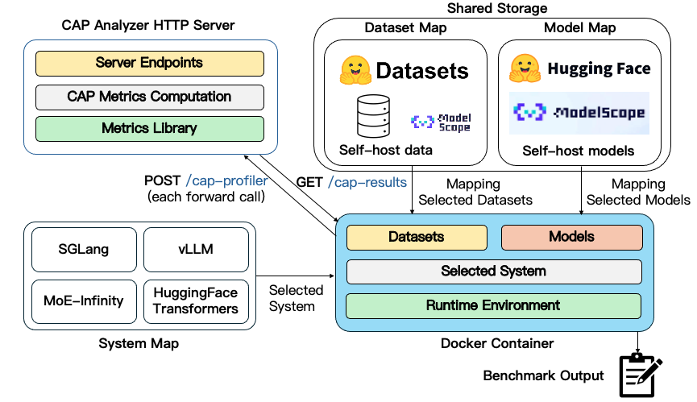

<p align="center">
  
</p>

# MoE-CAP

MoE-CAP is a benchmarking method designed to evaluate sparse MoE systems by integrating Cost, Accuracy, and Performance across these three dimensions.

## News
- MoE-CAP has been accepted to NeurIPS 2025 Dataset and Benchmark Track 🎉 See you in San Diego, US.

## Requirements
Python: >= 3.9

## Installation
```bash
git clone https://github.com/sparse-generative-ai/MoE-CAP.git
cd MoE-CAP
pip install -e .
```
Then you can import `moe_cap` directly.

## Quick Example
### SGLang
1. Launch our sglang custom server (e.g. H100)
```bash
python -m moe_cap.systems.sglang \ 
        --model-path Qwen/Qwen3-235B-A22B-Thinking-2507 \
        --port 30000 \
        --expert-distribution-recorder-mode stat \
        --tp-size 8 \
        --reasoning-parser deepseek-r1
```

2. Run our benchmark
```bash
python -m moe_cap.runner.sglang_profile \
        --config-file configs/gsm8k_qwen3_235b_a22b.yaml \
        --output_dir outputs/sglang/
```

The results will be stored under `outputs/sglang/`.

### vLLM
```bash
python -m moe_cap.systems.vllm \ 
        --model Qwen/Qwen3-235B-A22B-Thinking-2507 \
        --port 8000 \
        --host 0.0.0.0 \
        --tensor-parallel-size 8 \
        --reasoning-parser deepseek_r1 \
        --max-num-batched-tokens 131072 # Set max-num-batched-tokens large referring to vLLM tuning guide.
                                        # V1's mixed prefill-decode batching makes separate profiling difficult.
```

```bash
python -m moe_cap.runner.openai_api_profile \
        --config-file configs/gsm8k_qwen3_235b_a22b.yaml \
        --output_dir outputs/vllm/ \
        --api-url http://0.0.0.0:8000/v1/completions
```

The results will be stored under `outputs/vllm/`.

## Benchmark Pipeline


## Contributing to MoE-CAP

Thank you for your interest in contributing to the MoE-CAP project! We welcome contributions from everyone. Below you'll find guidance on how to set up your development environment, understand our architecture, and contribute effectively. If you have any questions or wish to discuss your contributions, please reach out to Yinsicheng Jiang, Yao Fu or Yeqi Huang via email at [ysc.jiang@ed.ac.uk](mailto:ysc.jiang@ed.ac.uk), [Y.Fu@ed.ac.uk](mailto:y.fu@ed.ac.uk) or [yeqi.huang@ed.ac.uk](mailto:yeqi.huang@ed.ac.uk).

### What We're Looking For in Contributions

We are looking for contributions in several key areas to enhance the MoE-CAP project:

1. **General Bug Fixes/Reports**: We welcome reports of any bugs found in the frontend interface or backend, as well as fixes for these issues.

2. **Adding New Tasks (Benchmark Datasets)**: If you have ideas for new benchmark datasets that could be added, your contributions would be greatly appreciated.

3. **Supporting New Inference Frameworks**: Expanding our project to support new inference frameworks is crucial for our growth. If you can contribute in this area, please reach out.

4. **Testing More Models**: To make our leaderboard as comprehensive as possible, we need to test a wide range of models. Contributions in this area are highly valuable.

Documentation is currently of lower priority, but if you have thoughts or suggestions, please feel free to raise them.

Your contributions are crucial to the success and improvement of the MoE-CAP project. We look forward to collaborating with you.

## Cite our paper
```
@misc{jiang2025moecapbenchmarkingcostaccuracy,
      title={MoE-CAP: Benchmarking Cost, Accuracy and Performance of Sparse Mixture-of-Experts Systems}, 
      author={Yinsicheng Jiang and Yao Fu and Yeqi Huang and Ping Nie and Zhan Lu and Leyang Xue and Congjie He and Man-Kit Sit and Jilong Xue and Li Dong and Ziming Miao and Dayou Du and Tairan Xu and Kai Zou and Edoardo Ponti and Luo Mai},
      year={2025},
      eprint={2412.07067},
      archivePrefix={arXiv},
      primaryClass={cs.LG},
      url={https://arxiv.org/abs/2412.07067}, 
}
```
